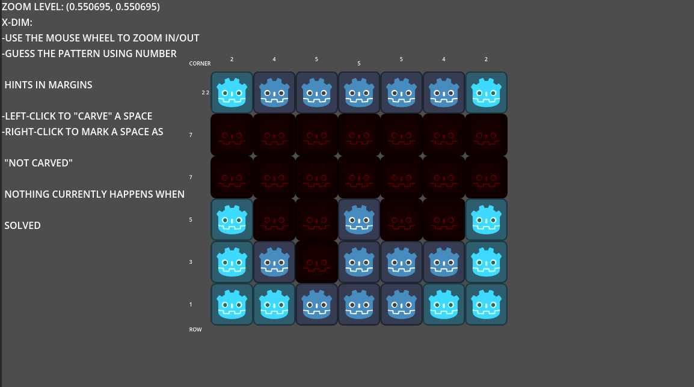

# PicrossExperiment
An attempt at implementing a Picross game in Godot.

What it looks like outside the box:

To test it out:

-Clone the project
-open the project.godot file in Godot (v4.7 or later)

WHY DID YOU STOP?

Too many bugs.  This was a good practice run to get familiar with UI objects in Godot, and a good lesson on proper delineation between game logic and presentation, as well as how to use (or how NOT to use) signals.
